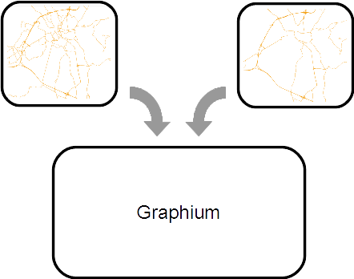
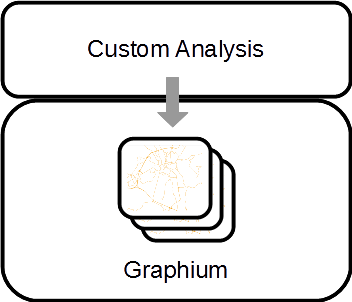
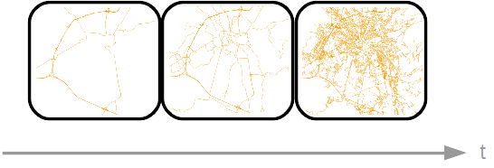
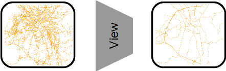
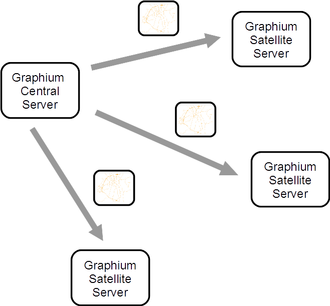

<p align="right">

</p>

# Graphium

Graphium is an Open Source project to store, manage and version transport graphs. Graph data can be stored from several data providers. With the REST-API imports and management is easy. Graphium is designed for deployment in distributed systems for centralized management and publishing to several servers.

## Features

### Import transport graphs from different sources

There are several providers of transport graph data. Each of them uses its own data format. Using those transport graph data is easy with Graphium. Either use an existing converter or implement an custom one to convert transport graph data into a JSON file. Currently there are converters for OpenStreetMap and GIP (Graph Integration Platform - a joint, nationwide transport graph of Austria) available. The transport graph data is imported into the Graphium server using the JSON file. The Extended Information data model allows to import additional information to the basic transport graph.

<p align="center">

</p>

### Uniform and expandable data model to fulfill specific use cases

After you have imported the transport graphs, you can access and process the data through its uniform data model. You can also enhance transport graphs and handle additional information.

<p align="center">

</p>

### Manage time restricted versions

Transport networks and their abstract mapping into digital transport graphs evolve over time. Graphium can import and manage several time restricted versions of one graph. This feature makes it possible to process data for real-time tasks as well as historic data processing.

<p align="center">

</p>

### Define Views

One major design decision was to keep one (or more) graph version(s) including all kind of data needed and set up various views for data only needed for special use cases. This approach is similar to database views. Hence it is possible to import the whole data of a graph and extract only way segment used by car or by bike using views.

<p align="center">

</p>

### Publish transport graphs to other servers

Graphium is designed for use in distributed systems. If data processing based on graph data has to be parallalized using a number of machines, graph data has to be distributed and persisted on them. With Graphium it is possible to define one central Graphium server for administration of used graph versions. On worker machines clients - so called satellite Graphium servers - can deployed and subscribe on the central Graphium server for one or more specific views on graph versions. The publishing of graph versions will be done on central Graphium server's side and guarantees a consistent state over all subscribers of one view.

<p align="center">

</p>


## Concepts

### Data Management & Expandability

For data management transport graph data has to be persisted. By default, Graphium uses PostgreSQL, but because of the interchangable database tier other DBMS could be used, too.

The base network model represents a directed graph consisting of waysegments and their connections. In PostgreSQL the entity *waysegments* stores data of graph segments (the linestring between two crossings) in a directed way, the segment entries itself are not directed. The entity *waysegment_connections* stores directed data for each connection between two joined segments. Both entities store an array of access types (in case of *waysegments* for each direction) representing the allowed usage for different vehicle types.

The base model is easy to expand if storage of additional data is needed. The entity *waysegments* is able to store tags as key-value-pairs. Alternatively, the entity *xinfo* (short for extended information) can be used. This entity defines the basic structure to reference waysegments and can be inherited to model your specific needs.

*PostgreSQL DB Scheme:*

<p align="center">

</p>

### Views

The concept of views in a DBMS means to filter only relevant data needed for further processing. Graphium uses the same concept to allow different views on transport graphs. For example a fine granulated transport graph is stored in database but for one specific analysis only cycle ways are necessary. Then you have to define a custom view returning only waysegments having the access type "BIKE".

To access those views over the API the graph name can be replaced with each view name. So graph name and view name will be treated similarly at the API.

Find out how to define [custom views](doc/CustomViews.md).

### States

A graph version is time restricted version of a single graph. Each graph version could assume a type of state. Those types of state are shown here:

| state          | description                                                  |
| -------------- | ------------------------------------------------------------ |
| INITIAL        | graph version is imported into the database; graph versions having this state are meant to be a pre-version, non productive-ready |
| PUBLISH        | graph version is being published to subscribed satellite servers |
| SYNCHRONIZED   | graph version is published to subscribed satellite servers (publish completed) |
| PUBLISH_FAILED | publishing of graph version failed on one or more subscribed satellite servers |
| ACTIVATING     | graph version is being activated on all subscribed satellite servers and the central server itself |
| ACTIVE         | graph version is activated on the central server and all subscribed satellite servers; graph version can be used for productive use cases; activating a graph version could trigger post processes and restricts the previous active version of the same graph with the current timestamp; |
| DELETED        | graph version is deleted                                     |

### Publish / Subscribe

Graphium is designed for use as a server in standalone mode or for deployment in distributed systems. The main use case in distributed systems is to deploy one Graphium central server storing all transport graph data needed within the whole system. One or more worker servers, so called Graphium satellite servers, could be deployed to process data based on specific transport graph data. This architecture supports horizontal scaling of Graphium satellite servers. All Graphium satellite servers will be automatically informed by the Graphium central server as soon as a new graph version is available to always process consistently on the newest transport graph version.

Detailed information about the publish / subscribe process can be found [here](doc/PublishSubscribe.md).

## Graph Data Conversion

To import transport graph data into Graphium data has to be converted into Graphium's input format (JSON). Data converters already exist for OSM or GIP, custom converters have to be implemented for other data sources.

### OSM

Example API call to generate a JSON file from OSM data:

`java osm2graphium.one-jar.jar -i /path/to/osm-andorra-latest.osm.pbf -o /path/to/output -n osm_at -v 200603 -q 20000 -t 5 –highwayTypes "motorway, motorway_link, primary, primary_link"`

Example API call to generate a JSON file from OSM data and import into a Graphium server:

`java osm2graphium.one-jar.jar -i /path/to/osm-andorra-latest.osm.pbf -o /path/to/output -n osm_at -v 200603 -q 20000 -t 5 –highwayTypes "motorway, motorway_link, primary, primary_link" -u "http://localhost:8080/graphium/api/segments/graphs/osm_andorra/versions/200603?overrideIfExists=true"`

Example API call to download a OSM file, generate a JSON file and import into a Graphium server:

`java osm2graphium.one-jar.jar -i http://download.geofabrik.de/europe/andorra-latest.osm.pbf -o /path/to/output -n osm_at -v 200603 -q 20000 -t 5 –highwayTypes "motorway, motorway_link, primary, primary_link" -u "http://localhost:8080/graphium/api/segments/graphs/osm_andorra/versions/200603?overrideIfExists=true"`

| short option | long option    | description                              |
| :----------- | :------------- | ---------------------------------------- |
| -h           | --help         | display this help page                   |
| -i           | --input        | path or URL to PBF File                 |
| -o           | --output       | path to result directory. (default: user.home) |
| -n           | --name         | Name of the graph to be imported         |
| -v           | --version      | Version of the graph to be imported      |
| -vf          | --valid-from   | start timestamp of graph version's validity (format 'yyyy-MM-dd HH:mm'); optional |
| -vt          | --valid-to     | end timestamp of graph version's validity (format 'yyyy-MM-dd HH:mm'); optional |
| -b           | --bounds       | Name of bounds file for geographical filtering (format alá Osmosis); optional |
| -q           | --queueSize    | Size of import queue; optional           |
| -t           | --threads      | Number of worker threads; optional       |
|              | --highwayTypes | Comma separated List of highway types, to be considered. If not set, all highway types will be considered; optional |
| -T		   | --tags			| mode how osm tags of ways are stored on created segments, allowed modes 'none','all', defaults to 'none'; optional |
| -d	| --downloadDir	| Directory to store download files; optional. If this parameter is not present download files will be stored in output directory |
| -df	| --keepDownloadFile	| 'false': downloaded file from URL will be deleted afterwards / 'true' will not be deleted; default = true |
| -fd	| --forceDownload	| 'false': if file exists in download directory this one will be used / 'true': download file from URL even if it has been already downloaded; default = false |
| -cf	| --keepConvertedFile	| 'false': converted file will be deleted afterwards / 'true': converted file will not be deleted; default = true |
| -u	| --importUrl	| Server URL to import the converted graph file; optional. |

### GIP

Example API call to generate a JSON file from GIP data:

`java idf2graphium.one-jar.jar -i /path/to/gip-at.txt -o /path/to/output -n gip_at_frc_0_8 -v 20_04_200603 --skip-pixel-cut -import-frcs "0,1,2,3,4,5,6,7,8"`

Example API call to generate a JSON file from GIP data and import into a Graphium server:

`java idf2graphium.one-jar.jar -i /path/to/gip-at.txt -o /path/to/output -n gip_at_frc_0_8 -v 20_04_200603 --skip-pixel-cut -import-frcs "0,1,2,3,4,5,6,7,8" -u "http://localhost:8080/graphium/api/segments/graphs/gip_at/versions/200603?overrideIfExists=true"`

Example API call to download a GIP file, generate a JSON file and import into a Graphium server:

`java idf2graphium.one-jar.jar -i http://open.gip.gv.at/ogd/A_routingexport_ogd.zip -o /path/to/output -n gip_at_frc_0_8 -v 20_04_200603 --skip-pixel-cut -import-frcs "0,1,2,3,4,5,6,7,8" -u "http://localhost:8080/graphium/api/segments/graphs/osm_andorra/versions/200603?overrideIfExists=true"`

| short option | long option                   | Beschreibung                                                 |
| ------------ | ----------------------------- | ------------------------------------------------------------ |
| -h           | --help                        | display this help page                                       |
| -i           | --input                       | path to IDF or compressed IDF File (ZIP)                     |
| -o           | --output                      | path to result directory. (default: user.home)               |
| -n           | --name                        | Name of the graph to be imported                             |
| -v           | --version                     | Version of the graph to be imported                          |
| -vf          | --valid-from                  | start timestamp of graph version's validity (format 'yyyy-MM-dd HH:mm'); optional |
| -vt          | --valid-to                    | end timestamp of graph version's validity (format 'yyyy-MM-dd HH:mm'); optional |
|              | --skip-gip-import             | skip the import process of the GIP, only pixel cuts will be generated. The options -o and --import-frcs are ignored; optional |
|              | –skip-pixel-cut               | skip the calculation of the turn offset factors. The options -m and -M are ignored; optional |
| -m           | --pixel-cut-min-frc           | minimum frc value to be considered for offset calculations; optional |
| -M           | --pixel-cut-max-frc           | maximum frc value to be considered for offset calculations; optional |
|              | --import-frcs                 | Comma separated List of FRC values to be included for IDF import. If not set (default) all frc values are considered; optional |
|              | --access-types                | Comma separated List of Access Types, to be considered. If not set, all access types will be considered; optional |
| -e           | --pixel-cut-enable-short-conn | By default short connections below 3.5 meter with frc 0 are ignored. This is to filter the connections between highways and streets. If this option is set all gip links are considered; optional |
| -fc            | --full-connectivity | Creates a full connected network ignoring one ways (default = false) |
|  | --xinfo-csv | Defines optional CSV file to convert into XInfo object; pattern: <FILENAME>=<XInfoFactoryClass><br />Therefore a jar is needed containing all necessary classes for creating and processing the custom XInfo objects (see graphium-pixelcuts). This jar has to linked via `java -cp executable.jar;libs/*;. at.srfg....IDFConverter`. The <XInfoFactoryClass> has to be a class implementing the interface ICsvXInfoFactory. All XInfo objects will be written to the output JSON file as xInfo array entries. Optional |
| -d	| --downloadDir	| Directory to store download files; optional. If this parameter is not present download files will be stored in output directory. |
| -df	| --keepDownloadFile	| 'false': downloaded file from URL will be deleted afterwards / 'true' will not be deleted; default = true |
| -fd	| --forceDownload	| 'false': if file exists in download directory this one will be used / 'true': download file from URL even if it has been already downloaded; default = false |
| -cf	| --keepConvertedFile	| 'false': converted file will be deleted afterwards / 'true': converted file will not be deleted; default = true |
| -u	| --importUrl	| Server URL to import the converted graph file; optional |

## API

[API Reference Documentation](doc/apiReferenceDocumentation.md)

## Quickstart

1. Install PostgreSQL: https://www.postgresql.org/download/

2. Install PostGIS: https://postgis.net/install/

3. Create Database (using *psql*)

   ```sql
   CREATE ROLE graphium LOGIN ENCRYPTED PASSWORD 'md5e85d3e0c9e3a933a0c9103b21ed017df'
      VALID UNTIL 'infinity';
   
   CREATE DATABASE graphium WITH OWNER = graphium;
   
   \i /path/to/graphium-postgis/db/composite/create_graphium_database.sql
   ```

4. Install Apache Tomcat: http://tomcat.apache.org/

5. Building

   `mvn clean install`

6. Deploy tutorial's Graphium central server (*graphium.war*) on Apache Tomcat and start

7. Download and convert OSM File into Graphium's JSON format, import into Graphium central server:

   ```shell script
   docker exec -it graphium-neo4j-server java -jar /osm2graphium.one-jar.jar -i http://download.geofabrik.de/europe/andorra-latest.osm.pbf -o / -n osm_andorra -fd true -v 200603 -q 20000 -t 5 -highwayTypes "motorway, motorway_link, primary, primary_link" -u "http://localhost:8080/graphium/api/segments/graphs/osm_andorra/versions/200603?overrideIfExists=true"
   ```
   
8. Activate imported graph version

    ```shell script
    curl -X PUT "http://localhost:8080/graphium/api/metadata/graphs/osm_andorra/versions/200603/state/ACTIVE"
    ```
    
9. Check server state

    ```shell script
    curl -X GET "http://localhost:8080/graphium/api/status"
    ```

## Docker

1. Start Docker setup

    ```shell script
    docker-compose up -d
    ```

Application and database logs can be obtained via `docker-compose logs`.

If any of the following steps crashes because of a Java heap exception you have configure memory definition of Docker.

2. Download and convert OSM File into Graphium's JSON format, import into Graphium central server:

   ```shell script
   docker exec -it graphium-neo4j-server java -jar /osm2graphium.one-jar.jar -i http://download.geofabrik.de/europe/andorra-latest.osm.pbf -o / -n osm_andorra -fd true -v 200603 -q 20000 -t 5 -highwayTypes "motorway, motorway_link, primary, primary_link" -u "http://localhost:8080/graphium/api/segments/graphs/osm_andorra/versions/200603?overrideIfExists=true"
   ```

3. Activate imported graph version

    ```shell script
    docker exec -it graphium-server curl -X PUT "http://localhost:8080/graphium/api/metadata/graphs/osm_andorra/versions/200603/state/ACTIVE"
    ```

4. Check server state

    ```shell script
    docker exec -it graphium-server curl -X GET "http://localhost:8080/graphium/api/status"
    ```

## Tutorials

### How to define custom views

Look at [custom views](doc/CustomViews.md).

### How to extend Graphium

Look at the tutorial package.

## Dependencies

- Jackson-annotations, Apache License, Version 2.0 (http://github.com/FasterXML/jackson)
- Jackson-core, Apache License, Version 2.0 (https://github.com/FasterXML/jackson-core)
- jackson-databind, Apache License, Version 2.0 (http://github.com/FasterXML/jackson)
- JTS Topology Suite, LGPL (http://sourceforge.net/projects/jts-topo-suite)
- Apache Commons Codec, Apache License, Version 2.0 (http://commons.apache.org/proper/commons-codec/)
- JUnit, Eclipse Public License 1.0 (http://junit.org)
- Apache Extras™ for Apache log4j™, Apache License, Version 2.0 (http://logging.apache.org/log4j/extras)
- Apache Log4j, Apache License, Version 2.0 (http://logging.apache.org/log4j/1.2/)
- Apache Commons Lang, Apache License, Version 2.0 (http://commons.apache.org/proper/commons-lang/)
- Apache Commons CLI, Apache License, Version 2.0 (http://commons.apache.org/proper/commons-cli/)
- Apache Commons FileUpload, Apache License, Version 2.0 (http://commons.apache.org/proper/commons-fileupload/)
- Apache HttpClient, Apache License, Version 2.0 (http://hc.apache.org/httpcomponents-client)
- Apache HttpCore, Apache License, Version 2.0 (http://hc.apache.org/httpcomponents-core-ga)
- Apache Commons IO, Apache License, Version 2.0 (http://commons.apache.org/proper/commons-io/)
- Jackson, Apache License, Version 2.0(http://jackson.codehaus.org)
- Data Mapper for Jackson, Apache License, Version 2.0 (http://jackson.codehaus.org)
- Hamcrest Core, New BSD License (https://github.com/hamcrest/JavaHamcrest/hamcrest-core)
- JCL 1.1.1 implemented over SLF4J, MIT License (http://www.slf4j.org)
- SLF4J API Module, MIT License (http://www.slf4j.org)
- SLF4J LOG4J-12 Binding, MIT License (http://www.slf4j.org)
- Spring AOP, Apache License, Version 2.0 (https://github.com/spring-projects/spring-framework)
- Spring Beans, Apache License, Version 2.0 (https://github.com/spring-projects/spring-framework)
- Spring Context, Apache License, Version 2.0 (https://github.com/spring-projects/spring-framework)
- Spring Core, Apache License, Version 2.0 (https://github.com/spring-projects/spring-framework)
- Spring Expression Language (SpEL), Apache License, Version 2.0 (https://github.com/spring-projects/spring-framework)
- Spring Transaction, Apache License, Version 2.0 (https://github.com/spring-projects/spring-framework)
- Spring Web, Apache License, Version 2.0 (https://github.com/spring-projects/spring-framework)
- Spring Web MVC, Apache License, Version 2.0 (https://github.com/spring-projects/spring-framework)
- spring-security-config, Apache License, Version 2.0 (http://spring.io/spring-security)
- spring-security-core, Apache License, Version 2.0 (http://spring.io/spring-security)
- spring-security-web, Apache License, Version 2.0 (http://spring.io/spring-security)
- Spring TestContext Framework, Apache License, Version 2.0 (https://github.com/spring-projects/spring-framewor)
- Wiremock, Apache License, Version 2.0 (http://wiremock.org)
- HikariCP, Apache License, Version 2.0 (https://github.com/brettwooldridge/HikariCP)
- fastutil, Apache License, Version 2.0 (http://fastutil.di.unimi.it/)
- Java Servlet API, CDDL + GPLv2 with classpath exception(http://servlet-spec.java.net)
- Postgis JDBC Driver, GNU Lesser General Public License (http://postgis.net/postgis-jdbc)
- Postgis JDBC Driver JTS Parser, GNU Lesser General Public License (http://postgis.net/postgis-jdbc-jtsparser)
- PostgreSQL JDBC Driver - JDBC 4.2, BSD-2-Clause (https://github.com/pgjdbc/pgjdbc)
- opencsv, Apache License, Version 2.0 (http://opencsv.sf.net)
- GNU Trove, GNU Lesser General Public License 2.1, (http://trove4j.sf.net)
- mockito-core, The MIT License (https://github.com/mockito/mockito)
- osmosis-pbf2, Public Domain (http://wiki.openstreetmap.org/wiki/Osmosis)
- osmosis-tagfilter, Public Domain (http://wiki.openstreetmap.org/wiki/Osmosis)
- osmosis-areafilter, Public Domain (http://wiki.openstreetmap.org/wiki/Osmosis)
