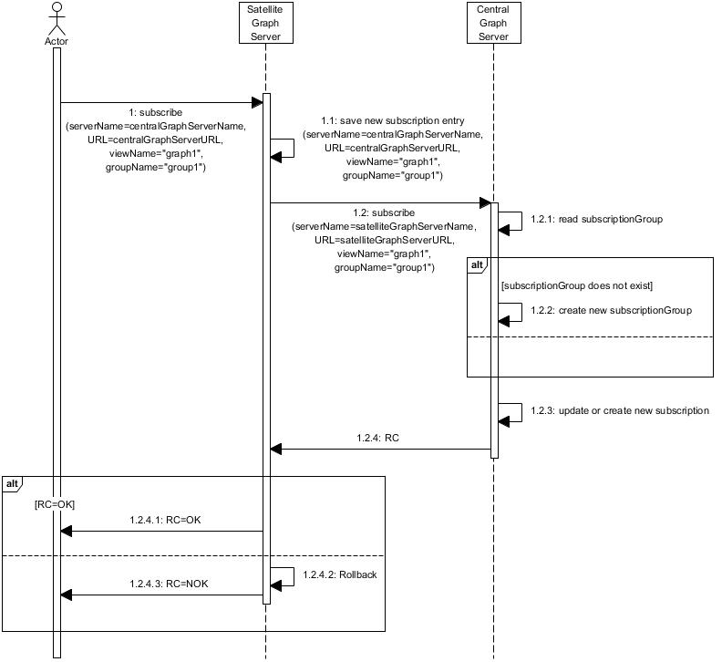
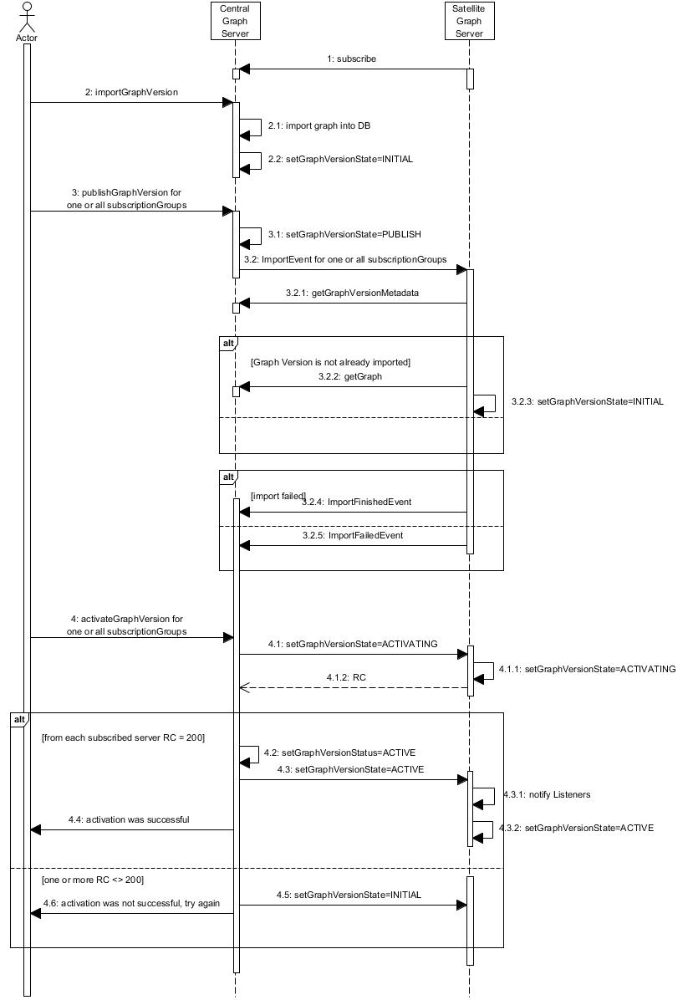
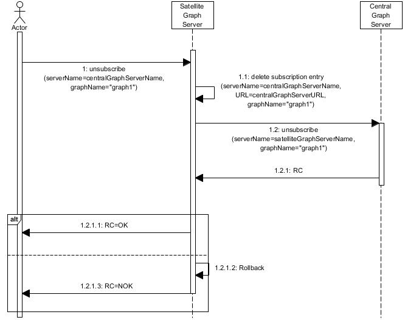

# Publish / Subscribe

Here are some sequence diagrams to show how publish / subscribe processes work.

## Subscribe

The user has to trigger the subscription on the Graphium Satellite Server.

## Publish

Graph version files have to be imported by the user into the Graphium central server. By triggering the publishing process of a new graph version all subscribed Graphium satellite servers subscribed for this graph will be informed to start its import process. For using the new graph version for further data processing the graph version has to be activated. The activation has to be performed on Graphium central server and guarantees a consistent state of the graph version over all subscribers.

## Unsubscribe

Subscribiptions also can be removed.

