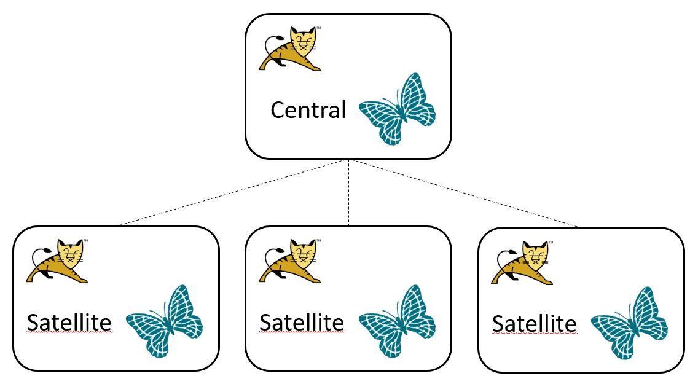

# Publish / Subscribe

Graphium is designed to work in standalone mode. But in some cases it is useful to deploy in a distributed system. For example you have to do a lot of workload done via horizontal scaling. Therefor you could deploy a central server containing all graph data needed within the system and several satellite servers containing only specific graph data for their work.

Graph data (transport graphs) change over time and has to be updated periodically. Let's say we are using 5 satellite servers calculating realtime data using an OSM graph. We have to update this graph every month. Therefor we have to download the OSM file, convert it into Graphium's data format and import it into every satellite server. This process could be time-consuming.

The idea of the publish / subscribe system using a central server is to import the graph data only once, namely into the central server. After the import is done we could request the central server to publish the graph data to all subscribed satellite servers. No copying of files onto our working machines has to be done. The import into each satellite server will be done automatically.

The publish / subscribe system also guarantees a consistent state over all subscribers of one view (see [States](../README.md)).

## Deployment

The deployment of Graphium servers within a distributed system could look like this:

There are some configuration issues to keep in mind for deploying Graphium server either in central or in satellite mode. A central server configuration can be found in the Maven module *graphium-tutorial-central-server*. It uses the *application-context-graphium-central-server.xml* for configuring the server in central mode via importing the *application-context-graphium-central-server-api.xml*. In this application context all central server specific configurations are defined. Moreover the property file *server.properties* defines all central server specific properties.

To configure a satellite server the *application-context-graphium-satellite-server-api.xml* has to be imported and der *server.properties* file has to be adapted.

To run a central or satellite server it (the Maven module) has to be built and deployed into a web server like Apache Tomcat®.

## Configuration

Once the Graphium servers are deployed the publish / subscribe system has to be configured. Here are some descriptions and sequence diagrams to show how publish / subscribe processes work.

### Subscribe

The user has to trigger the subscription on the Graphium satellite server.

Example URL:

`http://localhost:8081/graphium-satellite-server/api/graphs/osm_at/subscriptions?servername=central_server&url=http://localhost:8080/graphium/api&groupname=group_osm_at&user=satellite&password=satellite`

This HTTP POST means that the satellite server subscribes to the graph *osm_at* provided by the central server. Each subscription regards to a group. Graphs can be published either to all subscribers or only to a specific group. There could be more than one group defined to a graph.

See also [POST subscribe](api/post_subscribe.md).

### Publish & Activating

Graph version files have to be imported by the user into the Graphium central server. By triggering the publishing process of a new graph version all subscribed Graphium satellite servers subscribed for this graph (or a group of it) will be informed to start its import process.

Example URL to trigger the publishing process:

`http://localhost:8080/graphium/api/metadata/graphs/osm_at/versions/200603/state/PUBLISH`

For using the new graph version for further data processing the graph version has to be activated. The activation has to be performed on Graphium central server and guarantees a consistent state of the graph version over all subscribers.

Example URL to activate the new graph version:

`http://localhost:8080/graphium/api/metadata/graphs/osm_at/versions/200603/state/ACTIVE`

See also [PUT graph version metadata's property](api/put_graphVersionMetadataProperty.md).

### Unsubscribe

Subscribiptions also can be removed.

Example URL:

`http://localhost:8081/graphium-satellite-server/api/graphs/osm_at/subscriptions?servername=central_server`

See also [DELETE unsubscribe](api/delete_unsubscribe.md).

